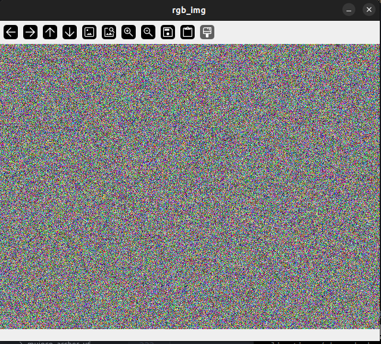

<h1 align="center">TUTORIAL</h1>

---

# Overview

This document shows how to use `hex_zmq_servers` to run examples and create your own application.

**Note**: Make sure you have installed the library from source code if you want to run the example-related tutorials below.

---

# Run minimal example

**Related Example**: `examples/basic/robot_dummy`

1. **Activate the virtual environment**

    ```bash
    cd path/to/hex_zmq_servers
    source .venv/bin/activate
    ```

2. **Run the launch script**

    Run the launch script:

    ```bash
    cd examples/basic/robot_dummy
    python launch.py
    ```

    The output should be like this:

    ```bash
    Using system clock
    [launcher] Terminal settings recorded
    [launcher] Started 2 nodes
    [launcher] Starting robot_dummy_cli
    [launcher] Starting robot_dummy_srv
    [robot_dummy_srv] Using system clock
    [robot_dummy_cli] Using system clock
    [robot_dummy_cli] dofs: 7
    [robot_dummy_cli] limits: [[[-1.  1.]
    [robot_dummy_cli]   [-1.  1.]
    [robot_dummy_cli]   [-1.  1.]]
    [robot_dummy_cli] 
    [robot_dummy_cli]  [[-1.  1.]
    [robot_dummy_cli]   [-1.  1.]
    [robot_dummy_cli]   [-1.  1.]]
    [robot_dummy_cli] 
    [robot_dummy_cli]  [[-1.  1.]
    [robot_dummy_cli]   [-1.  1.]
    [robot_dummy_cli]   [-1.  1.]]
    [robot_dummy_cli] 
    [robot_dummy_cli]  [[-1.  1.]
    [robot_dummy_cli]   [-1.  1.]
    [robot_dummy_cli]   [-1.  1.]]
    [robot_dummy_cli] 
    [robot_dummy_cli]  [[-1.  1.]
    [robot_dummy_cli]   [-1.  1.]
    [robot_dummy_cli]   [-1.  1.]]
    [robot_dummy_cli] 
    [robot_dummy_cli]  [[-1.  1.]
    [robot_dummy_cli]   [-1.  1.]
    [robot_dummy_cli]   [-1.  1.]]
    [robot_dummy_cli] 
    [robot_dummy_cli]  [[-1.  1.]
    [robot_dummy_cli]   [-1.  1.]
    [robot_dummy_cli]   [-1.  1.]]]
    [robot_dummy_cli] states pos: [0. 0. 0. 0. 0. 0. 0.]
    [robot_dummy_cli] states pos: [0. 0. 0. 0. 0. 0. 0.]
    [robot_dummy_cli] states pos: [0. 0. 0. 0. 0. 0. 0.]
    [robot_dummy_cli] states pos: [0. 0. 0. 0. 0. 0. 0.]
    [robot_dummy_cli] states pos: [0. 0. 0. 0. 0. 0. 0.]
    [robot_dummy_cli] states pos: [0. 0. 0. 0. 0. 0. 0.]
    [robot_dummy_cli] states pos: [0. 0. 0. 0. 0. 0. 0.]
    [robot_dummy_cli] states pos: [0. 0. 0. 0. 0. 0. 0.]
    [robot_dummy_cli] states pos: [-0.57065923 -0.10847895  0.47150318  0.30355811  0.73526353  0.17802687
    [robot_dummy_cli]   0.72503296]
    [robot_dummy_cli] states pos: [-0.40791607  0.20322785  0.00250975  0.9919617  -0.5184287   0.77329373
    [robot_dummy_cli]   0.24937261]
    [robot_dummy_cli] states pos: [0.1280518  0.89444013 0.20197725 0.98025206 0.44983321 0.23429165
    [robot_dummy_cli]  0.87720714]
    [robot_dummy_cli] states pos: [-0.9270477   0.21214999  0.44678168 -0.64064177  0.49714236  0.01660307
    [robot_dummy_cli]   0.91543287]
    [robot_dummy_cli] states pos: [ 0.04057374  0.28079445 -0.82811272  0.64766497 -0.17754106 -0.99067075
    [robot_dummy_cli]   0.92852885]
    ...
    ```

---

# Run example with real hardware

**Related Example**: `examples/adv/zero_gravity`

1. **Change the device parameters in `examples/adv/zero_gravity/launch.py`**

    Modify the device parameters in `examples/adv/zero_gravity/launch.py` to match your device.
    The default device parameters should be like this:

    ```python
    ...
    # robot model config
    ARM_TYPE = "archer_l6y"
    GRIPPER_TYPE = "gp100_p050_handle"
    if GRIPPER_TYPE == "empty":
        USE_GRIPPER = False
    else:
        USE_GRIPPER = True

    # server ports
    HEXARM_SRV_PORT = 12345

    # device config
    DEVICE_IP = "192.168.1.101"
    HEXARM_DEVICE_PORT = 9439
    ...
    ```

    Assuming:
    - The arm is `firefly_y6` without any gripper
    - The controller ip is `172.18.5.116`
    - The can port plugged in is `CAN0`, which means the device port is `8439`

    In this case, you can modify the `launch.py` as follows:

    ```python
    ...
    ARM_TYPE = "firefly_y6"
    GRIPPER_TYPE = "empty"
    if GRIPPER_TYPE == "empty":
        USE_GRIPPER = False
    else:
        USE_GRIPPER = True
    
    # server ports
    HEXARM_SRV_PORT = 12345

    # device config
    DEVICE_IP = "172.18.5.116"
    HEXARM_DEVICE_PORT = 8439
    ...
    ```

2. **Activate the virtual environment**

    ```bash
    cd path/to/hex_zmq_servers
    source .venv/bin/activate
    ```

3. **Run the launch script**

    Run the launch script:

    ```bash
    cd examples/adv/zero_gravity
    python launch.py
    ```

    The arm can be dragged around and stops when left alone.
    The output should be like this:

    ```bash
    ...
    wait
    ...
    ```

---

# Create your own application

If you only want to create your own application, you can choose the installation method you like (**from PyPI** or **from source code**).

*Assuming you want to create an **dummy rgb camera application***

1. **Make sure you have installed the library**

    - From PyPI

        ```bash
        pip list | grep hex_zmq_servers
        ```

    - From source code

        ```bash
        uv pip list | grep hex_zmq_servers
        ```

    If you can see `hex_zmq_servers` in the output, it means you have installed the library successfully.

2. **Create your own application**

    ```bash
    mkdir -p path/to/my_app
    touch path/to/my_app/cli.py
    touch path/to/my_app/cli.json
    touch path/to/my_app/launch.py
    ```

3. **Write your client code in `cli.py`**

    ```python
    import argparse, json
    from hex_zmq_servers import (
        HexRate,
        HexCamDummyClient,
    )

    import cv2


    def main():
        parser = argparse.ArgumentParser()
        parser.add_argument("--cfg", type=str, required=True)
        args = parser.parse_args()
        cfg = json.loads(args.cfg)

        # camera client
        net_config = cfg["net"]
        client = HexCamDummyClient(net_config=net_config)

        rate = HexRate(200)
        try:
            while True:
                rgb_hdr, rgb_img = client.get_rgb()
                if rgb_hdr is not None:
                    cv2.imshow("rgb_img", rgb_img)

                key = cv2.waitKey(1)
                if key == ord('q'):
                    break

                rate.sleep()
        finally:
            cv2.destroyAllWindows()


    if __name__ == '__main__':
        main()
    ```

4. **Write your config code in `cli.json`**

    ```json
    {
        "net": {
            "ip": "127.0.0.1",
            "port": 12345,
            "realtime_mode": false,
            "deque_maxlen": 10,
            "client_timeout_ms": 200,
            "server_timeout_ms": 1000,
            "server_num_workers": 4
        }
    }
    ```

5. **Write your launch code in `launch.py`**

    ```python
    import os
    from hex_zmq_servers import HexLaunch, HexNodeConfig
    from hex_zmq_servers import HEX_ZMQ_SERVERS_PATH_DICT, HEX_ZMQ_CONFIGS_PATH_DICT

    # node params
    SCRIPT_DIR = os.path.dirname(os.path.abspath(__file__))
    NODE_PARAMS_DICT = {
        # cli
        "cam_dummy_cli": {
            "name": "cam_dummy_cli",
            "node_path":
            f"{SCRIPT_DIR}/cli.py",
            "cfg_path":
            f"{SCRIPT_DIR}/cli.json",
            "cfg": {
                "net": {
                    "ip": "127.0.0.1",
                    "port": 12345,
                },
            },
        },
        # srv
        "cam_dummy_srv": {
            "name": "cam_dummy_srv",
            "node_path": HEX_ZMQ_SERVERS_PATH_DICT["cam_dummy"],
            "cfg_path": HEX_ZMQ_CONFIGS_PATH_DICT["cam_dummy"],
            "cfg": {
                "net": {
                    "ip": "127.0.0.1",
                    "port": 12345,
                },
            },
        },
    }


    def get_node_cfgs(node_params_dict: dict = NODE_PARAMS_DICT,
                    launch_arg: dict | None = None):
        return HexNodeConfig.parse_node_params_dict(
            node_params_dict,
            NODE_PARAMS_DICT,
        )


    def main():
        node_cfgs = get_node_cfgs()
        launch = HexLaunch(node_cfgs)
        launch.run()


    if __name__ == '__main__':
        main()
    ```

6. **Run your application**

    Run the launch script:

    ```bash
    cd path/to/my_app
    python launch.py
    ```

    You can see a random rgb image like this:
    

    The output should be like this:

    ```bash
    Using system clock
    [launcher] Terminal settings recorded
    [launcher] Started 2 nodes
    [launcher] Starting cam_dummy_cli
    [launcher] Starting cam_dummy_srv
    [cam_dummy_cli] Using system clock
    [cam_dummy_srv] Using system clock
    ```

---

# Run multiple launch

**Related Example**: `examples/adv/multi_launch`

1. **Activate the virtual environment**

    ```bash
    cd path/to/hex_zmq_servers
    source .venv/bin/activate
    ```

2. **Run the launch script**

    Run the launch script:

    ```bash
    cd examples/adv/multi_launch
    python launch.py
    ```

    The output should be like this:

    ```bash
    Using system clock
    params is HexNodeConfig
    params is HexNodeConfig
    params is HexNodeConfig
    final_cfg: [HexNodeConfig] Total 6 nodes:
    - robot_dummy_cli_0
    - robot_dummy_srv_0
    - robot_dummy_cli_1
    - robot_dummy_srv_1
    - robot_dummy_cli_2
    - robot_dummy_srv_2

    [launcher] Terminal settings recorded
    [launcher] Started 6 nodes
    [launcher] Starting robot_dummy_cli_0
    [launcher] Starting robot_dummy_srv_0
    [launcher] Starting robot_dummy_cli_1
    [launcher] Starting robot_dummy_srv_1
    [launcher] Starting robot_dummy_cli_2
    [launcher] Starting robot_dummy_srv_2
    [robot_dummy_cli_1] Using system clock
    [robot_dummy_cli_2] Using system clock
    [robot_dummy_srv_0] Using system clock
    [robot_dummy_srv_2] Using system clock
    [robot_dummy_cli_0] Using system clock
    [robot_dummy_srv_1] Using system clock
    [robot_dummy_cli_0] client send failed
    [robot_dummy_cli_0] client send failed; recreate socket
    [robot_dummy_cli_2] dofs: 7
    [robot_dummy_cli_2] limits: [[[-1.  1.]
    [robot_dummy_cli_2]   [-1.  1.]
    [robot_dummy_cli_2]   [-1.  1.]]
    [robot_dummy_cli_2] 
    [robot_dummy_cli_2]  [[-1.  1.]
    [robot_dummy_cli_2]   [-1.  1.]
    [robot_dummy_cli_2]   [-1.  1.]]
    [robot_dummy_cli_2] 
    [robot_dummy_cli_2]  [[-1.  1.]
    [robot_dummy_cli_2]   [-1.  1.]
    [robot_dummy_cli_2]   [-1.  1.]]
    [robot_dummy_cli_2] 
    [robot_dummy_cli_2]  [[-1.  1.]
    [robot_dummy_cli_2]   [-1.  1.]
    [robot_dummy_cli_2]   [-1.  1.]]
    [robot_dummy_cli_2] 
    [robot_dummy_cli_2]  [[-1.  1.]
    [robot_dummy_cli_2]   [-1.  1.]
    [robot_dummy_cli_2]   [-1.  1.]]
    [robot_dummy_cli_2] 
    [robot_dummy_cli_2]  [[-1.  1.]
    [robot_dummy_cli_2]   [-1.  1.]
    [robot_dummy_cli_2]   [-1.  1.]]
    [robot_dummy_cli_2] 
    [robot_dummy_cli_2]  [[-1.  1.]
    [robot_dummy_cli_2]   [-1.  1.]
    [robot_dummy_cli_2]   [-1.  1.]]]
    [robot_dummy_cli_2] states pos: [0. 0. 0. 0. 0. 0. 0.]
    [robot_dummy_cli_2] states pos: [0. 0. 0. 0. 0. 0. 0.]
    [robot_dummy_cli_2] states pos: [0. 0. 0. 0. 0. 0. 0.]
    [robot_dummy_cli_2] states pos: [0. 0. 0. 0. 0. 0. 0.]
    [robot_dummy_cli_2] states pos: [0. 0. 0. 0. 0. 0. 0.]
    [robot_dummy_cli_2] states pos: [0. 0. 0. 0. 0. 0. 0.]
    [robot_dummy_cli_2] states pos: [0. 0. 0. 0. 0. 0. 0.]
    [robot_dummy_cli_2] states pos: [0. 0. 0. 0. 0. 0. 0.]
    [robot_dummy_cli_2] states pos: [0. 0. 0. 0. 0. 0. 0.]
    [robot_dummy_cli_2] states pos: [-0.90795145 -0.15432486 -0.86066703  0.92837245 -0.69692672 -0.90474045
    [robot_dummy_cli_2]  -0.68014658]
    [robot_dummy_cli_2] states pos: [-0.34600167  0.29076375  0.84881299  0.92274642 -0.65970254  0.34985525
    [robot_dummy_cli_2]   0.92621954]
    [robot_dummy_cli_2] states pos: [-0.25698285 -0.58669302 -0.93216018 -0.8979918  -0.7800776  -0.37772459
    [robot_dummy_cli_2]  -0.59438565]
    [robot_dummy_cli_2] states pos: [-0.68637223 -0.98560066  0.85793123 -0.6549918   0.57551398 -0.71787952
    [robot_dummy_cli_2]   0.34242999]
    [robot_dummy_cli_2] states pos: [-0.68637223 -0.98560066  0.85793123 -0.6549918   0.57551398 -0.71787952
    [robot_dummy_cli_2]   0.34242999]
    [robot_dummy_cli_2] states pos: [-0.76815784 -0.99752512  0.21454683 -0.93229766  0.61235576  0.86362851
    [robot_dummy_cli_2]   0.93194491]
    [robot_dummy_cli_2] states pos: [-0.02162685  0.04862076 -0.86412411  0.20089693 -0.80082489  0.00642951
    [robot_dummy_cli_2]   0.19240195]
    [robot_dummy_cli_1] dofs: 7
    [robot_dummy_cli_1] limits: [[[-1.  1.]
    [robot_dummy_cli_1]   [-1.  1.]
    [robot_dummy_cli_1]   [-1.  1.]]
    [robot_dummy_cli_1] 
    [robot_dummy_cli_1]  [[-1.  1.]
    [robot_dummy_cli_1]   [-1.  1.]
    [robot_dummy_cli_1]   [-1.  1.]]
    [robot_dummy_cli_1] 
    [robot_dummy_cli_1]  [[-1.  1.]
    [robot_dummy_cli_1]   [-1.  1.]
    [robot_dummy_cli_1]   [-1.  1.]]
    [robot_dummy_cli_1] 
    [robot_dummy_cli_1]  [[-1.  1.]
    [robot_dummy_cli_1]   [-1.  1.]
    [robot_dummy_cli_1]   [-1.  1.]]
    [robot_dummy_cli_1] 
    [robot_dummy_cli_1]  [[-1.  1.]
    [robot_dummy_cli_1]   [-1.  1.]
    [robot_dummy_cli_1]   [-1.  1.]]
    [robot_dummy_cli_1] 
    [robot_dummy_cli_1]  [[-1.  1.]
    [robot_dummy_cli_1]   [-1.  1.]
    [robot_dummy_cli_1]   [-1.  1.]]
    [robot_dummy_cli_1] 
    [robot_dummy_cli_1]  [[-1.  1.]
    [robot_dummy_cli_1]   [-1.  1.]
    [robot_dummy_cli_1]   [-1.  1.]]]
    [robot_dummy_cli_1] states pos: [0. 0. 0. 0. 0. 0. 0.]
    [robot_dummy_cli_2] states pos: [-0.49535673 -0.90195708  0.59395474  0.23598223 -0.9987101  -0.41485471
    [robot_dummy_cli_2]  -0.89284637]
    [robot_dummy_cli_1] states pos: [0. 0. 0. 0. 0. 0. 0.]
    [robot_dummy_cli_2] states pos: [-0.4102623  -0.68467191 -0.75275966  0.70473198 -0.60167853  0.41769439
    [robot_dummy_cli_2]  -0.41425364]
    [robot_dummy_cli_1] states pos: [0. 0. 0. 0. 0. 0. 0.]
    [robot_dummy_cli_2] states pos: [ 0.23795834 -0.37281141 -0.88220337  0.02156277 -0.81669302  0.09034459
    [robot_dummy_cli_2]  -0.85225456]
    [robot_dummy_cli_1] states pos: [0. 0. 0. 0. 0. 0. 0.]
    [robot_dummy_cli_2] states pos: [-0.37743942  0.17437041  0.57091366 -0.3338822   0.5109137  -0.4278204
    [robot_dummy_cli_2]   0.06578377]
    [robot_dummy_cli_1] states pos: [0. 0. 0. 0. 0. 0. 0.]
    [robot_dummy_cli_2] states pos: [-0.14023694 -0.80309097  0.9856765  -0.05578339 -0.75745421  0.11657334
    [robot_dummy_cli_2]  -0.90605674]
    [robot_dummy_cli_1] states pos: [0. 0. 0. 0. 0. 0. 0.]
    [robot_dummy_cli_2] states pos: [-0.0486172  -0.2162807   0.34033183 -0.15314857 -0.48937427 -0.50125389
    [robot_dummy_cli_2]   0.34976377]
    [robot_dummy_cli_1] states pos: [0. 0. 0. 0. 0. 0. 0.]
    [robot_dummy_cli_2] states pos: [-0.0486172  -0.2162807   0.34033183 -0.15314857 -0.48937427 -0.50125389
    [robot_dummy_cli_2]   0.34976377]
    [robot_dummy_cli_1] states pos: [0. 0. 0. 0. 0. 0. 0.]
    [robot_dummy_cli_2] states pos: [0.74923822 0.34315232 0.18996641 0.34866935 0.87146105 0.56373609
    [robot_dummy_cli_2]  0.77946471]
    [robot_dummy_cli_1] states pos: [-0.79467491 -0.66656011  0.61719506  0.20882644 -0.78914861 -0.17896946
    [robot_dummy_cli_1]   0.56812292]
    [robot_dummy_cli_2] states pos: [ 0.70002776 -0.92636723 -0.80201431  0.66217954 -0.15638297  0.76761722
    [robot_dummy_cli_2]  -0.7591432 ]
    [robot_dummy_cli_1] states pos: [ 0.90353029 -0.5660705  -0.68467015 -0.44123175 -0.71938792 -0.8823364
    [robot_dummy_cli_1]  -0.94102318]
    [robot_dummy_cli_2] states pos: [ 0.47543131 -0.82710233 -0.71831258  0.00777322 -0.86948173 -0.46492865
    [robot_dummy_cli_2]   0.00340371]
    ...
    [robot_dummy_cli_1] states pos: [-0.91044067  0.46801365 -0.70827462 -0.75657486  0.40007032  0.16330813
    [robot_dummy_cli_1]  -0.39219852]
    [robot_dummy_cli_2] states pos: [-0.5812829   0.45849297  0.04724961 -0.51701122  0.1219319  -0.82890215
    [robot_dummy_cli_2]   0.58723834]
    [robot_dummy_cli_0] dofs: 7
    [robot_dummy_cli_1] states pos: [ 0.34085156  0.78992201  0.50864544 -0.80686668  0.05875701 -0.59336166
    [robot_dummy_cli_1]  -0.06714557]
    [robot_dummy_cli_0] limits: [[[-1.  1.]
    [robot_dummy_cli_0]   [-1.  1.]
    [robot_dummy_cli_0]   [-1.  1.]]
    [robot_dummy_cli_0] 
    [robot_dummy_cli_0]  [[-1.  1.]
    [robot_dummy_cli_0]   [-1.  1.]
    [robot_dummy_cli_0]   [-1.  1.]]
    [robot_dummy_cli_0] 
    [robot_dummy_cli_0]  [[-1.  1.]
    [robot_dummy_cli_0]   [-1.  1.]
    [robot_dummy_cli_0]   [-1.  1.]]
    [robot_dummy_cli_0] 
    [robot_dummy_cli_0]  [[-1.  1.]
    [robot_dummy_cli_0]   [-1.  1.]
    [robot_dummy_cli_0]   [-1.  1.]]
    [robot_dummy_cli_0] 
    [robot_dummy_cli_0]  [[-1.  1.]
    [robot_dummy_cli_0]   [-1.  1.]
    [robot_dummy_cli_0]   [-1.  1.]]
    [robot_dummy_cli_0] 
    [robot_dummy_cli_0]  [[-1.  1.]
    [robot_dummy_cli_0]   [-1.  1.]
    [robot_dummy_cli_0]   [-1.  1.]]
    [robot_dummy_cli_0] 
    [robot_dummy_cli_0]  [[-1.  1.]
    [robot_dummy_cli_0]   [-1.  1.]
    [robot_dummy_cli_0]   [-1.  1.]]]
    [robot_dummy_cli_0] states pos: [0. 0. 0. 0. 0. 0. 0.]
    [robot_dummy_cli_2] states pos: [-0.5966731  -0.27086985  0.13381444  0.14397452 -0.37009842  0.98319029
    [robot_dummy_cli_2]   0.74172614]
    [robot_dummy_cli_1] states pos: [-0.15310551 -0.07003877 -0.98030507 -0.77409072 -0.81123624 -0.89335826
    [robot_dummy_cli_1]  -0.85243133]
    [robot_dummy_cli_2] states pos: [-0.88429723 -0.74239625 -0.42288007  0.5825745  -0.90357576  0.5529623
    [robot_dummy_cli_2]  -0.85487391]
    [robot_dummy_cli_0] states pos: [0. 0. 0. 0. 0. 0. 0.]
    [robot_dummy_cli_1] states pos: [-0.82926744 -0.86741258  0.94292945 -0.08388594  0.84804068 -0.26428924
    [robot_dummy_cli_1]   0.07144348]
    [robot_dummy_cli_0] states pos: [0. 0. 0. 0. 0. 0. 0.]
    [robot_dummy_cli_2] states pos: [ 0.47468556 -0.37015516 -0.72720277 -0.35167926  0.29278571  0.03878758
    [robot_dummy_cli_2]  -0.30857644]
    [robot_dummy_cli_1] states pos: [ 0.51304821  0.62365369 -0.56301884  0.38683114  0.36816749 -0.93921961
    [robot_dummy_cli_1]  -0.10164623]
    [robot_dummy_cli_0] states pos: [0. 0. 0. 0. 0. 0. 0.]
    [robot_dummy_cli_2] states pos: [ 0.82007689 -0.19981795 -0.49165676  0.22663294  0.86370739  0.34484163
    [robot_dummy_cli_2]   0.62894196]
    [robot_dummy_cli_1] states pos: [-0.5529386  -0.86110566  0.94580899  0.3167968   0.73785194 -0.45030561
    [robot_dummy_cli_1]   0.29912259]
    [robot_dummy_cli_0] states pos: [0. 0. 0. 0. 0. 0. 0.]
    [robot_dummy_cli_2] states pos: [-0.72167801 -0.45946414  0.47435154 -0.88496565  0.0571054  -0.13540144
    [robot_dummy_cli_2]   0.40547228]
    [robot_dummy_cli_1] states pos: [ 0.12285089  0.401283   -0.04167882 -0.1511177   0.27488763  0.82711961
    [robot_dummy_cli_1]   0.4779829 ]
    [robot_dummy_cli_0] states pos: [0. 0. 0. 0. 0. 0. 0.]
    [robot_dummy_cli_2] states pos: [-0.61477775  0.07004343  0.55060502  0.60048364  0.19520682  0.08094276
    [robot_dummy_cli_2]  -0.41198326]
    [robot_dummy_cli_1] states pos: [ 0.99028694  0.37764572  0.5307163   0.89188795 -0.02941268  0.19601656
    [robot_dummy_cli_1]   0.54396778]
    [robot_dummy_cli_0] states pos: [0. 0. 0. 0. 0. 0. 0.]
    [robot_dummy_cli_2] states pos: [ 0.62074859  0.59560575  0.73339475  0.11949308 -0.39100018  0.82409607
    [robot_dummy_cli_2]  -0.4264602 ]
    [robot_dummy_cli_1] states pos: [ 0.25880363 -0.7556589  -0.92643768 -0.391035    0.20279222  0.34213048
    [robot_dummy_cli_1]  -0.92148212]
    [robot_dummy_cli_0] states pos: [0. 0. 0. 0. 0. 0. 0.]
    [robot_dummy_cli_2] states pos: [-0.53584126 -0.2731988   0.96265093  0.15537848 -0.1272786   0.87585157
    [robot_dummy_cli_2]   0.29646926]
    [robot_dummy_cli_1] states pos: [-0.74457379  0.53912911  0.69771613  0.21053463  0.39292239 -0.63188694
    [robot_dummy_cli_1]  -0.34881591]
    [robot_dummy_cli_0] states pos: [-0.72580541  0.09792096  0.24521957  0.60680677  0.53458396  0.39753696
    [robot_dummy_cli_0]  -0.71616683]
    [robot_dummy_cli_2] states pos: [ 0.22357221  0.29535269  0.11316729 -0.83087987 -0.34395292  0.49345865
    [robot_dummy_cli_2]   0.09051365]
    [robot_dummy_cli_1] states pos: [-0.03781498 -0.08888562  0.95184887 -0.94962468  0.86509139 -0.06763879
    [robot_dummy_cli_1]  -0.11921404]
    [robot_dummy_cli_0] states pos: [-0.0881685  -0.27205597  0.13284377 -0.486927   -0.1063541  -0.30848102
    [robot_dummy_cli_0]  -0.76252334]
    [robot_dummy_cli_2] states pos: [ 0.13700709 -0.02755254 -0.59672742  0.18559343 -0.44309336  0.21451112
    [robot_dummy_cli_2]   0.37526775]
    ...
    ```
